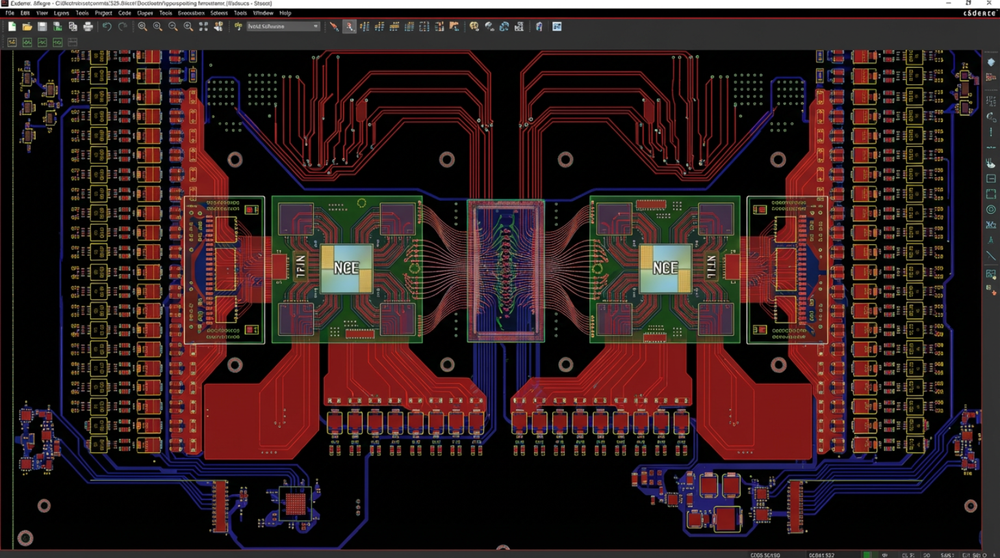

# LightRail AI Compute Node — System Architecture

## 1. Block diagram

```
                 ┌───────────── FRONT PANEL ─────────────┐
                 │  MPO-24 Optical  |  Status LEDs  |  USB-C BMC  │
                 └────────┬───────────────────────┬────────────────┘
                          │ 8 TX / 8 RX / monitor │
              ┌───────────┴───────┐       ┌───────┴───────────┐
              │ Optical Engine A   │       │ Optical Engine B   │
              │ 8× DFB 1550 nm +   │       │ 8× DFB 1550 nm +   │
              │ TEC + PD + TIA     │       │ TEC + PD + TIA     │
              └─────┬───────┬──────┘       └─────┬───────┬─────┘
                    │ RF    │ BIAS               │ RF    │ BIAS
                    ▼       ▼                    ▼       ▼
              ┌──────────────────┐         ┌──────────────────┐
              │ TFLN PIC A        │         │ TFLN PIC B        │
              │ 8 ch × 200G PAM4  │         │ 8 ch × 200G PAM4  │
              │ (1.6 Tbps aggreg) │         │ (1.6 Tbps aggreg) │
              └────────┬─────────┘         └────────┬─────────┘
                       │ RF diff drive              │ RF diff drive
                       ▼                            ▼
     ┌──────────────────────────┐        ┌──────────────────────────┐
     │ NCE A + 4× HBM4          │◀──PCIe Gen 6 x16──▶│ PCIe Switch   │
     │ (co-packaged on silicon  │        │ NCE B + 4× HBM4          │
     │  interposer, BGA-2500)   │        │ (same composite module)  │
     │ — NCE die, 40×40, 0.8mm  │        │ — same as A              │
     │ — 4× HBM4 12-Hi stacks   │        └──────┬──────┬────────────┘
     │ — TFLN SerDes (16×)      │               │      │
     │ — PCIe Gen 6 root (x32)  │               │      │── NVMe M.2 / U.3
     │ — V_core: 0.8 V, 1000 A+ │               │      │
     └─────────────┬────────────┘               │      │
                   │                            │      │
                   │ 1024-lane HBM4 data bus is INTERNAL to the interposer
                   │ (never reaches PCB copper). PCB only carries HBM4
                   │ side-channel signals: REFCK_P/N, CATTRIP, PWR_GOOD,
                   │ IEEE1500 test bus (TCK/TMS/TDI/TDO), and the
                   │ VDDC/VDDQL/VDDQ/VPP power rails into the module BGA.
                   └── PCIe Gen 6 edge ──────────┘
                                                       │
                                         EC / PMBus / I²C / SPI flash
                                                       │
                                                       ▼
                                               System Management
                                          (BMC, sensors, fan ctl, TPM)

  Power input: 12 V ── 2× 24-phase DrMOS VRM (ISL69260 + ISL99390) ─► V_core
                    └─ LDO/buck tree ─► 3.3 V, 1.8 V, 1.2 V, 1.05 V, 0.9 V
```

## 1.5 Rev 6.0 floorplan (canonical)



The image above is the **canonical top-side floorplan** for LR-P3A Rev 6.0.
All Rev 6.0 placement decisions in the `.kicad_pcb` and the associated
fabrication outputs must mirror this topology:

```
    ┌─────────── 420 × 350 mm server-class outline ────────────┐
    │  [DrMOS col L, 24φ]     [TFLN A]           [NCE A]       │
    │                         ▲                                │
    │                         │ TFLN direct-to-die ribbon      │
    │                         ▼                                │
    │  [DrMOS col L, 24φ]     ┌─────────────────┐  [NCE A]     │
    │                         │ Central TFLN     │              │
    │                         │ Photonic Bridge  │              │
    │                         │ (1.6 Tbps,       │              │
    │                         │  zero-copper)    │              │
    │  [DrMOS col R, 24φ]     └─────────────────┘  [NCE B]     │
    │                         ▲                                │
    │                         │ TFLN direct-to-die ribbon      │
    │                         ▼                                │
    │  [DrMOS col R, 24φ]     [TFLN B]           [NCE B]       │
    │                                                          │
    │  [DrMOS bottom row — B.Cu vertical delivery under NCE]   │
    └──────────────────────────────────────────────────────────┘
```

Floorplan rules captured from the reference image:

1. **NCE A and NCE B** (composite BGA-2500 modules with HBM4 on interposer)
   are placed symmetrically left and right of board centre.
2. **TFLN PIC A and TFLN PIC B** are placed inboard of each NCE, with a
   zero-copper direct-to-die optical ribbon (spec §IV) running between
   the TFLN and the NCE. The TFLN edge couplers face inward toward the
   **central TFLN photonic bridge**, which carries the 1.6 Tbps aggregate
   bandwidth between the two NCE chiplets and is a pure photonic
   interconnect — no PCB copper in the datapath.
3. **DrMOS 24-phase arrays** are placed in four clusters:
   - Left column (12 φ): V_CORE_U0 bank A
   - Right column (12 φ): V_CORE_U1 bank A
   - Bottom row under each NCE footprint on **B.Cu** (vertical power
     delivery per spec §III): V_CORE_U0 bank B and V_CORE_U1 bank B
   Each bank contains 12 DrMOS phases (2 banks per SoC = 24 phases per
   SoC, 48 DrMOS phases total on the board).
4. **Tiered PDN decoupling** fans out radially from the NCE/HBM4 ball
   field: Tier-4 01005 caps within 1 mm of every power ball, Tier-3
   0402 caps under the BGA, Tier-2 0805 caps on B.Cu under the NCE,
   Tier-1 bulk tantalum/polymer at each DrMOS output (spec §III).
5. **Optical keep-outs** at the MPO-24 exit point on the board edge
   (front panel) and a clear 100 mil copper-free zone around each TFLN
   PIC edge coupler (spec §V).
6. **Four M3 mounting holes** at the board corners plus four inner M3
   bolster holes per NCE (50 mm square) for the direct-to-chip cold plate.

The Rev 6.0 `.kicad_pcb` retains the 168 × 100 mm PCIe HHHL scaffold
outline from Rev 4.x/5.0; a PCB engineer must expand the outline and
migrate placements to match this floorplan in the KiCad GUI before
tapeout (see `docs/Fab_Notes.md` §1.1 for the ordered migration steps).

## 2. Functional specification

### 2.1 Compute

| Parameter                 | Value                                                          |
| ------------------------- | -------------------------------------------------------------- |
| AI SoC count              | 2                                                              |
| SoC architecture          | 128-way SIMD load/store streaming NCE, bfloat16/24, 16 matrix + 16 vector registers |
| SoC package               | BGA-2500 composite (NCE + interposer + 4× HBM4), 40 × 40 mm    |
| SoC V_core                | 0.8 V typ., 1000 A+ peak per module (NCE + 4× HBM4 combined)   |
| SoC I/O                   | VDD_IO 1.05 V / 1.2 V, HBM4 VDDQ 1.1 V                         |
| PCIe root                 | Gen 6.0, x32 per SoC (split x16 + x16)                         |
| Memory                    | 4× HBM4 12-Hi per module (interposer-coupled, see §2.3)        |
| TFLN SerDes               | 16 lanes @ 200 G PAM4 per SoC (8 TX + 8 RX)                    |
| CPO optical placement     | Direct-to-die TFLN ribbon (zero-copper datapath); edge coupler aligned with module courtyard (spec §IV). Interconnect energy 5–10 pJ/bit vs. 15–20 pJ/bit pluggable. |
| Power target (peak)       | 800 W per SoC (V_core) + 100 W (I/O + mem) = 900 W per SoC     |

### 2.2 Photonics

| Parameter                 | Value                                                          |
| ------------------------- | -------------------------------------------------------------- |
| Modulator type            | Thin-Film Lithium Niobate (TFLN), Mach-Zehnder, push-pull       |
| Channels                  | 8 per PIC, 2 PICs (16 total)                                   |
| Wavelength                | 1550 nm C-band DWDM grid, 100 GHz spacing                      |
| Line rate                 | 200 Gbps PAM4 per lane                                         |
| Aggregate BW              | 16 × 200 G = **1.6 Tbps** (half-duplex), 3.2 Tbps FD equivalent |
| Vπ · L                    | ~2.5 V · cm (typical TFLN)                                      |
| RF drive                  | ±1.5 V differential, 50 Ω terminated                           |
| Laser                     | 1550 nm DFB, 20 mW, TEC + thermistor                           |
| Detector                  | InGaAs PIN-PD, TIA (on TFLN carrier or chiplet)                |
| Optical connector         | MPO-24 (16 fiber SM + 8 fiber monitor/cal)                      |

### 2.3 Memory (HBM4, co-packaged)

| Parameter                 | Value                                                          |
| ------------------------- | -------------------------------------------------------------- |
| Topology                  | HBM4 on silicon interposer, co-packaged with NCE as single BGA |
| Stacks per module         | 4 × HBM4 12-Hi, 48 GB per stack → 192 GB per module            |
| Modules                   | 2 (one per NCE) → 384 GB aggregate                             |
| Data bus per stack        | 1024 lanes @ 8 Gbps/pin (1.0 TB/s per stack, 4.0 TB/s/module)  |
| Data-bus routing          | Entirely INTERPOSER-INTERNAL — never reaches PCB copper        |
| PCB-routed side-channel   | REFCK_P/N, CATTRIP, PWR_GOOD, IEEE1500 (TCK/TMS/TDI/TDO)       |
| Power rails (into module) | VDDC 0.7 V, VDDQL 0.4 V, VDDQ 1.1 V, VPP 1.8 V, VSS            |
| Interposer                | Vendor-supplied (TSMC CoWoS-L / Intel Foveros-S class); board  |
|                           | sees only the composite BGA footprint + side-channel pins      |

### 2.4 PCIe

| Parameter                 | Value                                                          |
| ------------------------- | -------------------------------------------------------------- |
| Generation                | PCIe Gen 6.0 (64 GT/s per lane, PAM4)                          |
| Edge connectors           | 1 × x16 primary, 1 × x16 expansion (via switch or direct)      |
| Retimers                  | Required (e.g. ASTERA PT6, MONTAGE M88RT51632); NDA parts      |
| Reference clock           | 100 MHz LP-HCSL, SRC0..1                                       |

### 2.5 Power

| Rail                      | Source                  | Voltage | Current (peak) | Regulator              |
| ------------------------- | ----------------------- | ------- | -------------- | ---------------------- |
| +12 V input               | PCIe 12VHPWR (600 W×2)  | 12 V    | 150 A          | —                      |
| V_core A / B              | 24-phase DrMOS          | 0.8 V   | 1000 A+        | ISL69260 + 24× ISL99390 |
| VDD_IO                    | Multi-phase buck        | 1.05 V  | 40 A           | TPS543C20 × 4          |
| VDDC (HBM4)               | Buck                    | 0.7 V   | 60 A           | TPS543C20              |
| VDDQL (HBM4)              | Buck                    | 0.4 V   | 30 A           | TPS543C20              |
| VDDQ (HBM4)               | Buck                    | 1.1 V   | 40 A           | TPS544C20              |
| VPP (HBM4)                | Buck                    | 1.8 V   | 8 A            | TPS62810               |
| 3.3 V aux                 | Buck                    | 3.3 V   | 15 A           | TPS54360               |
| 1.8 V aux                 | LDO                     | 1.8 V   | 3 A            | TPS7A20                |
| 1.2 V aux                 | LDO                     | 1.2 V   | 2 A            | TPS7A20                |
| 0.9 V (TFLN RF)           | LDO, low-noise          | 0.9 V   | 1 A            | ADP7118-0.9 (fixed)    |

### 2.6 Management

- **BMC / EC:** AST2600 or MEC172x (footprint placeholder)
- **PMBus:** VRM telemetry (V, I, T, phase count) @ 400 kHz
- **I²C:** HBM4 module SPD/ID (via module BGA), TFLN TEC driver, sensors
- **SPI flash:** UEFI/BIOS + BMC firmware, redundant (A/B)
- **TPM 2.0:** SLB 9670 on LPC/SPI
- **Sensors:** 6× thermal diodes (2 per SoC, 1 per VRM, 1 inlet)
- **Fans / pump:** 4× PWM PWM tach, direct-to-chip header

## 3. Power budget

| Domain                    | Typical | Peak  |
| ------------------------- | ------- | ----- |
| SoC A V_core              | 400 W   | 800 W |
| SoC B V_core              | 400 W   | 800 W |
| SoC I/O + TFLN RF (both)  | 80 W    | 140 W |
| HBM4 (8 stacks, 2 mods)   | 120 W   | 200 W |
| PCIe retimers + switch    | 25 W    | 40 W  |
| BMC + aux                 | 15 W    | 20 W  |
| **Total**                 | **1040 W** | **2000 W** |

## 4. Signal-flow notes

- **Host path:** PCIe Gen 6 edge → retimer → SoC root complex. Max trace +
  retimer insertion loss budget: 32 dB @ Nyquist (16 GHz), per PCIe 6.0 CEM.
- **Optical TX path:** SoC SerDes → TFLN RF drive (differential, 100 Ω diff) →
  TFLN modulator → DFB laser bias tee → MPO-24.
- **Optical RX path:** MPO-24 → PD array → TIA → SoC SerDes RX.
- **HBM4 side-channel (PCB):** REFCK_P/N differential pair (100 Ω) matched to ±0.3 mm (≈ 2 ps on Megtron-7 stripline); CATTRIP / PWR_GOOD routed as single-ended slow status signals; IEEE1500 JTAG routed as 50 Ω SE with series-term.
- **HBM4 data bus:** NOT on PCB — 1024 lanes × 4 stacks = 4096 lanes per module routed inside the vendor-supplied silicon interposer.
- **V_core:** 24-phase DrMOS array on **B.Cu directly under each NCE** (vertical power delivery per spec §III). Plane-to-plane delivery via 4× paralleled 2 oz V_core planes per domain. Target DC resistance ≤ 0.5 mΩ, AC impedance < 5 mΩ DC–100 MHz (spec §III).
- **Tiered PDN decoupling (spec §III):** 100 µF tantalum bulk at each DrMOS output → 10 µF 0805 mid-range → 1 µF 0402 plane-distributed → 100 nF 01005 within 1 mm of every NCE / HBM4 power ball. The Faradflex BC24 embedded-capacitance layer pair (In15↔In16) contributes ≈ 4.9 µF of distributed capacitance and suppresses the resonance hole between the 1 µF and 100 nF tiers.

## 5. Clock tree

```
12 MHz XTAL ─► Si5395A (jitter cleaner) ─┬─► 100 MHz HCSL → PCIe REFCLK (4×)
                                         ├─► 156.25 MHz LVPECL → SerDes ref
                                         ├─► 200 MHz LVDS → HBM4 REFCK (per stack)
                                         └─► 10 MHz sync → TFLN DAC trigger
```

Jitter budget: <100 fs RMS (10 kHz – 20 MHz) for PCIe Gen 6 REFCLK.

## 6. Thermal plan summary

- Liquid cold plate on each SoC (expected TDP 800 W peak).
- Airflow across VRM inductors (each 30 A × 0.4 mΩ DCR = 0.36 W × 24 = 8.6 W per VRM).
- TFLN PIC held at 25 ± 2 °C via TEC.
- Inlet air or coolant ≤ 45 °C; full spec in `docs/SI_PI_Thermal_Plan.md` §3.
